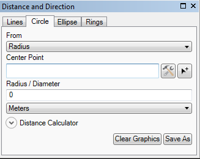

# distance-direction-addins-dotnet

The add-in provides the ability to create geodesic features such as lines, circles, ellipses and range rings.  Features can be exported to a file geodatabase, shapefile, or KML.

 

## Features

* Creates geodesy lines, circles, ellipses and range rings.
* Inputs can be entered manually or via a known coordinate.
* Features can be exported to a file geodatabase, shapefile, or KML.
* Addin for ArcMap and ArcGIS Pro 

## Sections

* [Requirements](#requirements)
* [Instructions](#instructions)
* [Resources](#resources)
* [Licensing](#licensing)

## Requirements

### Developers 

* Visual Studio 2015
* ArcGIS Desktop SDK for .NET 10.3.1+
	* [ArcGIS Desktop for .NET Requirements](https://desktop.arcgis.com/en/desktop/latest/get-started/system-requirements/arcobjects-sdk-system-requirements.htm)
* ArcGIS Pro 2.1+ SDK

### ArcGIS for Desktop Users

* [ArcGIS Desktop 10.3.1+](http://desktop.arcgis.com/en/arcmap/10.3/get-started/system-requirements/arcgis-desktop-system-requirements.htm)
* ArcGIS Pro 2.1+

## Instructions

### Development Environment 

* Building
	* To Build Using Visual Studio
		* Open and build solution file
	* To use MSBuild to build the solution
		* Open a Visual Studio Command Prompt: Start Menu | Visual Studio 2013 | Visual Studio Tools | Developer Command Prompt for VS2013
		* ` cd distance-and-direction-addin-dotnet\source\DistanceAndDirection\ArcMapAddinDistanceAndDirection `
		* ` msbuild ArcMapAddinDistanceAndDirection.sln /property:Configuration=Release `
	* To run Unit test from command prompt
		* Open a Visual Studio Command Prompt: Start Menu | Visual Studio 2013 | Visual Studio Tools | Developer Command Prompt for VS2013
		* ` cd distance-direction-addin-dotnet\source\DistanceAndDirection\ArcMapAddinDistanceAndDirection.Tests\bin\Release `
		* ` MSTest /testcontainer:ArcMapAddinDistanceAndDirection.Tests.dll `* 
	* Note : Assembly references are based on a default install of the SDK, you may have to update the references if you chose an alternate install option

### Running

* To download and run the pre-built add-in, see the instructions at [solutions.arcgis.com](http://solutions.arcgis.com/defense/help/distance-direction)

## Resources

* [ArcGIS for Defense Distance and Direction Component](http://solutions.arcgis.com/defense/help/distance-direction/)
* [Military Tools for ArcGIS](https://esri.github.io/military-tools-desktop-addins/)
* [Military Tools for ArcGIS Solutions Pages](http://solutions.arcgis.com/defense/help/military-tools/)
* [ArcGIS for Defense Solutions Website](http://solutions.arcgis.com/defense)
* [ArcGIS for Defense Downloads](http://appsforms.esri.com/products/download/#ArcGIS_for_Defense)
* [ArcGIS 10.3 Help](http://resources.arcgis.com/en/help/)
* [ArcGIS Blog](http://blogs.esri.com/esri/arcgis/)
* [@EsriDefense](http://twitter.com/EsriDefense)
* [ArcGIS Solutions Website](http://solutions.arcgis.com/military/)

## Licensing

Copyright 2016-2017 Esri

Licensed under the Apache License, Version 2.0 (the "License");
you may not use this file except in compliance with the License.
You may obtain a copy of the License at

   http://www.apache.org/licenses/LICENSE-2.0

Unless required by applicable law or agreed to in writing, software
distributed under the License is distributed on an "AS IS" BASIS,
WITHOUT WARRANTIES OR CONDITIONS OF ANY KIND, either express or implied.
See the License for the specific language governing permissions and
limitations under the License.

A copy of the license is available in the repository's [license.txt](../../license.txt) file.

